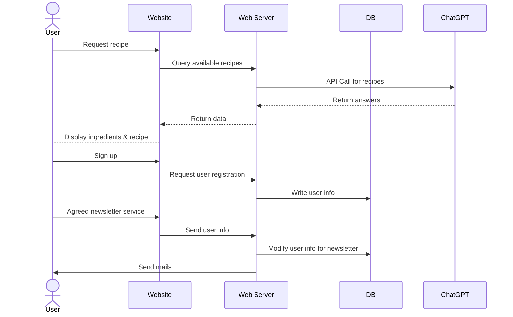
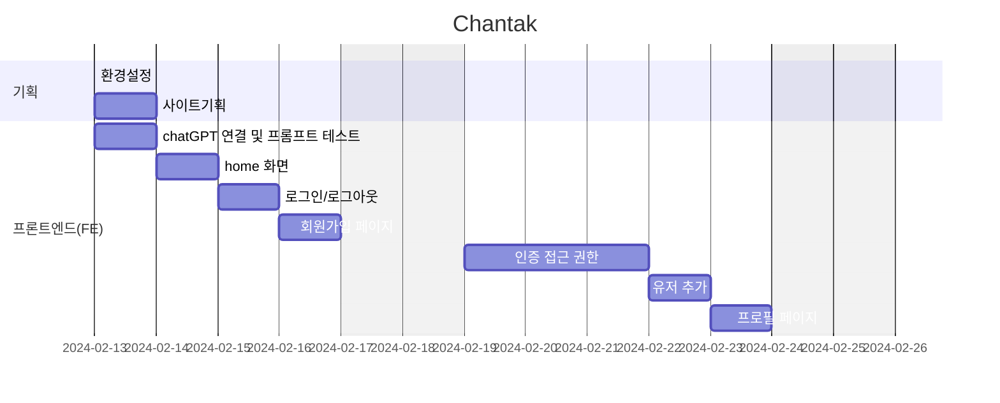

# Chantak(찬탁) - Authentic Locally
찬탁(饌卓)은 예전에 부엌에 있던 가구로 주로 식기를 보관하는 용도로 사용되었습니다. 
장의 기능을 포함한 찬탁은 식재료도 보관했다고 합니다.  

현지 제철 재료로 외국 음식을 만들어 먹을 수 있다면 좋겠다는 생각에서 제작하게 되었습니다. 

## 1. 목표와 기능

### 1.1 서비스 목표
-  다른 나라 요리의 레시피를 사용자 지역의 로컬 식재료로 구성해서 제공함
-  쉽고 낮은 가격으로 해외 음식을 경험할 수 있게 함 

### 1.2 시스템 기능
-  사용자가 요리명과 거주국가를 입력하면 레시피를 제공

## 2. 개발 환경 및 배포 URL
### 2.1 개발 스택
- HTML/CSS/JavaScript

### 2.2 배포 URL
- [https://northeast23.github.io/Chantak](https://northeast23.github.io/Chantak/)

### 2.3 URL 구조

|URL|페이지 설명|GET|POST|PUT|DELETE|로그인 권한| 작성자 권한|
|------|---|:---:|:---:|:---:|:---:|:---:|:---:|
|/accounts/login|로그인| |✔️| | | | |
|/accounts/logout|로그아웃| |✔️| | | | |
|/accounts/signup|회원가입| |✔️| | | | |
|/accounts/profile|프로필   프로필 수정   회원 탈퇴|✔️     | |✔️|  ✔️|✔️   ✔️   ✔️|  ✔️   ✔️
|/accounts/token/refresh|토큰갱신| |✔️| | | | |
|/board|게시글 목록   게시글 생성|✔️  | ✔️| | |   ✔️| |
|/board/{postid}|게시글 상세   게시글 수정   게시글 삭제|✔️   | |✔️|  ✔️|   ✔️   ✔️ |   ✔️   ✔️
 

## 3. 메인 기능 시퀀스 다이어그램 

## 4. 프로젝트 구조와 개발 일정
### 4.1 프로젝트 구조

  

 

### 4.1 개발 일정(WBS)

## 5. 와이어프레임 / UI / BM

### 5.1 화면 설계

### 5.2 실행 화면

## 6. 에러와 에러 해결
* chatGPT 답변을 JSON 으로 받기도 어려웠고, 처리하는 것은 계속 오류가 남.

  : 답변을 JSON 으로 받도록 질의에 JSON 포맷에 넣어줌. 재확인 문장도 넣어줌.
* 한글로 사용자가 입력하는 경우 답변 처리가 안되거나 오류가 나는 경우가 더 많음.

  : 사용자가 영어로 입력하도록 유도하기위해 input 안내문구를 넣음.
 
